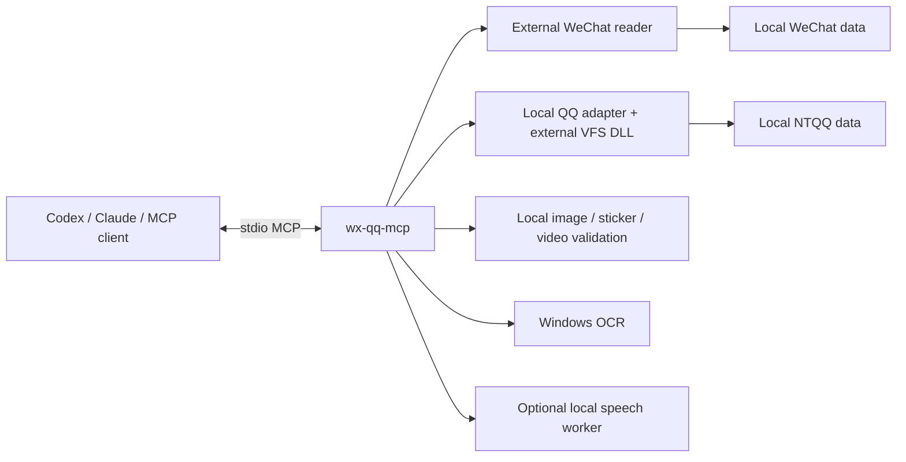

# wx-qq-mcp

**把本机微信和 QQ 历史接入同一个 MCP 入口，并补充媒体校验、图片 OCR 和可选的本地语音识别。**

这是一个面向 Windows x64 的源码集成项目，适用于 Codex、Claude Code 等支持 stdio MCP 的客户端。当前公开版为 **0.2.1（Alpha）**。它依赖已经可用的微信本地读取器，以及 QQ 的数据库扩展和本机账号数据；这些第三方程序、密钥和模型不包含在仓库里。

## 能做什么

| 能力 | 范围 |
|---|---|
| 一个入口读取两平台 | 25 个微信工具、10 个 `qq_*` 工具、5 个 `unified_*` 工具，共 40 个 |
| 历史记录与检索 | 会话解析、消息时间线、关键词查询、发送者与来源标记、分页和导出 |
| 两平台合并 | 保留各来源身份，按时间排序，用独立来源游标分页 |
| 微信图片与表情 | 按消息资源或内容摘要定位，完整解码检查；部分 DAT 恢复为独立副本 |
| QQ 图片 | 按消息文件名查找；对于 MD5 文件名，可在已知历史月份中精确匹配 |
| 图片文字 | Windows 本地 OCR；长截图分片识别；`unified_read_image` 可返回真实图像预览 |
| 微信语音 | 可选 SenseVoice / Whisper 本地识别、成功缓存、原音路径、自动识别标识 |
| 微信视频 | 检查视频流与首帧，返回可用本地文件；可按需生成预览帧 |
| 资源控制 | 微信读取子进程和语音工作进程按需启动、空闲退出；失败不会伪装成没有消息 |

继承的微信工具还包括群成员、群公告、朋友圈及互动、收藏、转账/红包记录、数据库结构和只读 SQL，具体取决于所接入微信读取器的兼容性。QQ 撤回记录只会引用本地已有缓存，不能恢复从未保存的原文。详细清单见 [工具说明](docs/TOOLS.md)。

## 数据流与隐私边界



数据库读取、媒体处理、OCR 和 ASR 在本机完成，语音识别不向在线 ASR 服务上传原音。**MCP 返回的文字和图片会交给客户端；如果客户端使用云模型，这些返回内容可能随模型请求离开本机。** 因而“本地处理”不等于整个 AI 使用链路完全离线。

原聊天数据库以只读方式打开。导出、派生图片、音频和成功缓存会写入指定的本地目录。仓库不提供发送消息工具。详见 [安全与数据处理](SECURITY.md)。

## 安装前提

- Windows x64，Python **3.12 或更高**；目前主要验证 Python 3.12。
- 一个能独立读取本人本机数据、并提供兼容 stdio MCP 工具的微信读取器。
- 使用 QQ 功能时，需要本机 NTQQ 数据目录和独立取得的 [NTQQ VFS 扩展](https://github.com/artiga033/ntdb_unwrap)。
- OCR 需要 Windows 中安装相应识别语言；视频探测需要 FFmpeg，FFprobe 可作为元数据探测辅助。
- 语音识别属于可选安装，使用独立 Python 环境及模型。

本项目保留与早期 R266 Tech 微信读取器接口的兼容，曾对本地保留的 1.5.x 与 1.6.4 进行对照。上游仓库目前存在访问限制；本项目不重新分发其源码或二进制，也不宣称适配任意最新版。请先确认外部读取器可以独立工作。

## 快速开始

```powershell
py -3.12 -m venv .venv
.\.venv\Scripts\python.exe -m pip install -e .

# 根据你的实际安装位置填写；不要把个人配置提交到仓库。
$env:UNIFIED_WECHAT_COMMAND = 'C:/path/to/wx-mcp.exe'
$env:UNIFIED_WECHAT_ARGS = '[]'

# QQ 可不配置。未配置时工具目录仍可加载，QQ 查询会提示缺少配置。
$env:QQ_MCP_DB_ROOT = 'C:/path/to/account/nt_qq/nt_db'
$env:QQ_MCP_EXTENSION = 'C:/path/to/sqlite_ext_ntqq_db.dll'

.\.venv\Scripts\python.exe -m unified_mcp.server --call unified_sources
```

如果使用提供 `serve-mcp` 子命令的微信程序，可设置：

```powershell
$env:UNIFIED_WECHAT_COMMAND = 'C:/path/to/wechat-cli.exe'
$env:UNIFIED_WECHAT_ARGS = '["serve-mcp"]'
```

QQ 数据库通常需要当前账号对应的密钥。本项目支持已有环境变量、Windows DPAPI 保护文件，以及显式执行的本地初始化脚本。**不会在启动时扫描其他账号或自动提取密钥。** 参见 [安装与配置](docs/SETUP.md)。

## 接入 Codex / Claude

两者可以使用同一个入口，示例见 [examples](examples)。例如 Codex 的 `config.toml`：

```toml
[mcp_servers.wx-mcp]
command = 'C:/path/to/wx-qq-mcp/.venv/Scripts/python.exe'
args = ['-m', 'unified_mcp.server']
startup_timeout_sec = 30
tool_timeout_sec = 300

[mcp_servers.wx-mcp.env]
UNIFIED_WECHAT_COMMAND = 'C:/path/to/wx-mcp.exe'
QQ_MCP_DB_ROOT = 'C:/path/to/account/nt_qq/nt_db'
QQ_MCP_EXTENSION = 'C:/path/to/sqlite_ext_ntqq_db.dll'
```

先用 `unified_resolve_chat` 确认联系人候选，再把核实的稳定 ID 交给 `unified_timeline`。同名联系人不会被自动认作同一个人。更新程序后需重连 MCP，旧的 stdio 进程不会自动换成新代码。

## 可选语音识别

先查看安装计划，再明确选择模型：

```powershell
.\.venv\Scripts\python.exe scripts/setup_voice.py --model sensevoice --plan
.\.venv\Scripts\python.exe scripts/setup_voice.py --model sensevoice
```

支持 `sensevoice`、`whisper` 或 `both`。模型由官方来源下载到包外数据目录，遵守各自模型许可；不包含在 Git 仓库或本项目 MIT 许可中。ASR 输出明确标注实际引擎、是否自动识别及复核提示。不能把自动识别文字当作人工听写真值。

## 导出与本地阅读

```powershell
.\.venv\Scripts\python.exe -m unified_mcp.export_snapshot `
  --wechat wxid_example --qq u_example --output C:/local-exports/example

wx-qq-reader --input C:/local-exports/example/merged.jsonl `
  --output C:/local-exports/example/reader.html --title '本地聊天阅读'
```

消息快照会记录分页终点与范围。基础快照默认不批量识别微信媒体；`media_inventory` 和 `process_media` 提供显式的分批处理与断点续取。阅读页只使用输入文件里的媒体路径；没有实体的消息仍显示缺失状态，不会生成虚构图片或语音内容。

## 当前限制

- 只能读取本机已经同步、可解密的数据。聊天记录存在，不代表对应媒体文件也存在。
- 一部分微信图片 CDN 字段是协议票据，本项目没有实现该图片下载协议。表情的明确远程引用可通过独立脚本取回并校验。
- QQ 并非所有消息类型和额外数据库均已验证；微信语音/视频能力不等同于 QQ 全媒体支持。
- 合并分页固定时间上界，但不是不可变数据库事务快照；历史迁移或删除期间可能需要重查。
- QQ 大范围查询仍会加载匹配记录，数据库级 seek 分页尚未完成。
- 多客户端共用磁盘缓存，**尚未共用一个后台进程**；同时连接可能增加常驻内存。
- “图片可解码”“OCR 有文字”“视频首帧可解码”分别代表不同验证范围，不等于完整理解所有内容。
- 当前为 Windows 源码发行版，不包含现成 EXE、一键获取第三方读取器或个人账号配置。

## 开发与验证

```powershell
python -m unittest discover -s unified_mcp -p 'test_*.py' -v
python scripts/check_release.py
```

测试使用合成数据和独立临时目录。公开包不携带实际聊天记录、图片、转写、截图或个人验收报告。发布前另做无 QQ 账号配置的 MCP 握手，确认能加载工具目录并准确报告配置缺失。详见 [验证方法](docs/TESTING.md)。

## 许可证与归属

新增集成代码与文档采用 [MIT](LICENSE)。微信工具 schema、QQ 格式参考和所有第三方依赖保留各自许可。模型、DLL、外部读取器和 FFmpeg 不由本项目的 MIT 许可重新授权。详见 [第三方说明](THIRD_PARTY_NOTICES.md)。
