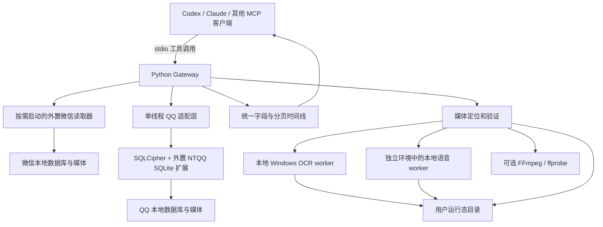

# 架构与数据边界

本文描述公开版 **0.2.1** 的实际实现。它是运行在 Windows 上的本地 MCP 网关，将外置微信读取器、本地 QQ 适配层和可选媒体处理统一为一个 stdio 入口。它不包含微信或 QQ 客户端，也不代替客户端同步历史数据。

## 请求流向

`server.py` 负责工具注册、路由、异常转换和可选媒体补充。微信工具定义来自保留的上游 schema；QQ 定义由 `qq_mcp_server.py` 提供。`timeline.py` 将两个来源的结果标准化并合并，保留原始记录，而不把两个账号或两个来源的消息混为同一条。

## 读取器与身份识别

微信侧通过 `backend.py` 的队列调用独立 stdio 子进程。读取器首次使用时启动，空闲后退出；初始化、请求和退出都有超时处理。退出未完成或请求被取消会报错，不能作为成功读取。更换读取器可配置 `UNIFIED_WECHAT_COMMAND` 与 `UNIFIED_WECHAT_ARGS`，但这并不意味着新旧工具 schema、返回结构和媒体能力自动兼容。

QQ 侧在首次调用时载入 `qq_adapter.py`，数据库操作在网关内的单线程执行器中串行运行。`QQ_MCP_DB_ROOT` 必须显式选定目标账号；未配置时不自动挑选账号。QQ 功能缺少配置不会阻止微信工具独立查询。

QQ 适配层按数据库盐值选取已经验证的密钥，使用 SQLCipher 与外置 NTQQ 扩展打开本地库。密钥准备脚本可只读扫描已登录的 QQ 进程，验证后使用 Windows DPAPI 保存；普通查询不会自行执行这一步。诊断返回配置状态和路径，不返回密钥正文。DPAPI 的保护范围是相应 Windows 用户环境，不能将受保护密钥文件直接当作通用配置分发。

会话先解析为稳定标识。多个候选不能唯一确定时返回错误；跨平台同名仅作为候选线索。发送者方向依据明确的账号和发送者字段判断，证据不足保留 `unknown`，不会把“不是对方”直接推成“我”。

## 合并与分页

统一时间线分别请求所选来源的消息页，按时间排序，并只推进本页实际使用的各来源偏移。同一秒内保留来源内原顺序。每条记录保留来源、会话标识、消息标识、记录标识、发送者、方向以及 `original`；微信服务器消息标识可能被不同本地记录复用，不能仅按该字段去重。

游标含查询条件指纹、各来源偏移和 `snapshot_before`。它用于续页和检查条件是否一致，不是凭据，也不是加密的数据库快照。初次查询确定时间上界，后续仍读取活的本地数据库；历史补同步、迁移、撤回和删除会影响偏移。因此，完成一次分页只表示读到当时可见的本地记录终点。

任一所选来源报错时，合并结果为 `partial`，不会推进游标或返回看似完整的主时间线；已取得的单来源页放在 `available_source_pages` 供检查。QQ 的主消息库不可读会失败，辅助全文检索库不可读则可带警告退回主库内容。QQ 已把时间范围下推到 SQL，但范围内记录仍可能全部进入内存后再过滤、排序和分页；这不是完整的数据库流式分页实现。

## 媒体处理

媒体补充发生在已经读取消息之后。补充失败通常保留原消息并增加警告，不把图片占位、文件名或路径字符串当作已读到媒体内容。

| 处理 | 实现及结果边界 |
| --- | --- |
| 微信图片和表情 | 按消息身份及资源线索定位文件；解码验证后才提供可读引用。支持部分本地加密媒体解码及缓存副本修复；原图、缩略图和缺失状态分别保留 |
| QQ 图片 | 根据消息线索查找对应缓存月份及必要的历史候选，进行完整图像解码验证；存在冲突时不任选文件。其他 QQ 媒体尚未覆盖所有格式 |
| OCR | `image_text.py` 调用本地 Windows OCR；同一网关复用 worker。较大图片分片识别，消息中的多种图片版本优先选择较大可用版本。文本是自动识别结果 |
| 语音 | `voice_transcription.py` 在独立 Python 环境中按需启动 worker，优先读取已有成功缓存；已配置 SenseVoice 模型时可使用该引擎，否则使用 Whisper。结果包含实际引擎及状态 |
| 视频 | 校验本地视频资源并使用可用解码工具探测，可生成抽帧预览。可播放文件、封面和缺失分开表示；探测成功不代表每一帧或整段声音已经检查 |
| 图片预览 | `unified_read_image` 返回 OCR，并可附送缩小后的图片。动画预览仅显示首帧，不能代表完整动画 |
| 缺失表情下载 | 独立的显式操作，限受约束的腾讯资源地址，下载后验证内容。普通聊天查询不会自动执行此下载流程 |

语音模型不会随普通文字查询常驻加载，语音 worker 也有空闲退出。OCR worker 在网关内按需创建并复用，随网关关闭清理。实际 CPU、内存和等待时间取决于模型、媒体尺寸、数据范围、运行实例数量与机器负载，当前没有跨机器的资源上限保证。

可通过查询参数 `include_image_text=false` 跳过 OCR；使用相关工具的媒体开关跳过媒体补充；`WX_UNIFIED_VOICE_CACHE_ONLY=1` 只读取已有语音转写缓存。关闭某项处理不会产生该项内容已经识别的结论。

## 运行态与缓存

新网关的可写数据默认放在用户级运行态目录 `%LOCALAPPDATA%\wx-qq-mcp`，可通过 `WXQQ_DATA_DIR` 指定。代码安装目录与这些数据分离。设置新的目录不会自动迁移旧缓存。外置微信读取器仍可能使用自己的配置和缓存目录，不能认为它们全由 `WXQQ_DATA_DIR` 接管。

| 数据 | 用途与生命周期 |
| --- | --- |
| `qq/` | DPAPI 密钥文件、显式消息缓存和媒体副本；缓存可能包含明文消息 |
| `voice-asr/` | 独立识别环境、用户另行取得的模型、成功转写缓存及相关派生文件；可用专门的 ASR 环境变量覆盖位置 |
| `image-text/` | OCR 成功结果和处理时使用的临时分片 |
| `wechat-media/`、`media-repair/` | 可用的派生媒体和修复副本 |
| `media_metadata/`、内容索引文件 | 本地资源定位的辅助信息 |
| `sticker-download/`、`video-previews/` | 显式下载的表情及生成的视频预览 |
| 指定的导出路径 | 消息、阅读文件或报告；由调用者选择，未必位于运行态目录 |

OCR 缓存依据图片内容摘要，语音缓存结合音频内容、模型信息和识别设置校验；不把“引擎缺失”“超时”等失败永久写成成功。部分 OCR 结果不会冒充完整成功缓存。媒体缓存还要经过内容或身份匹配检查，不能仅凭扩展名复用。

多个客户端可以配置相同磁盘目录，但**每个 stdio 连接仍启动独立网关进程**，各自拥有微信子进程、QQ 执行器和可选识别 worker。目前没有供全部客户端共用的后台服务，也没有跨进程的统一任务去重与调度。共用缓存文件不等于共用模型内存，更不能保证同时写入缓存或导出时不会竞争。

## 原库只读与本地写入

QQ 数据库使用只读打开方式，并在适配层设置只读查询；微信数据库的只读访问依赖外置读取器的实现。网关还会写入派生缓存、密钥保护文件、修复副本和导出文件。`cache_refresh`、`cache_rebuild`、`qq_cache_recent`、导出工具都是有本地写入效果的操作；`cache_rebuild` 会删除重建读取器缓存。

不要把这些写入描述为“修改原聊天记录”，也不要把整个工具描述为“完全不落盘”。例如 `qq_export_messages` 会覆盖同名输出文件；独立批量导出模块可以有不同的覆盖策略，应以所调用的具体入口为准。密钥受保护不代表消息缓存、OCR 和转写缓存同样被加密。

## 本地处理与客户端数据边界

数据库读取、媒体验证、OCR 和语音推理在本机执行。ASR worker 使用预先安装的模型并以离线模式运行，网关没有配置云端转写 API。安装依赖、另行下载模型，以及显式执行缺失表情下载会产生网络访问；不能把整个安装和使用流程称为永不联网。

MCP 结果会交给调用它的客户端。结果中可以含聊天文本、自动转写、OCR、图片预览、本地路径或诊断信息；如果客户端使用云端模型，这些结果可能按客户端行为发送给其模型服务。**本地识别不等于内容始终不会离开电脑。** 网关不能控制 Codex、Claude 或其他客户端后续如何构造上下文、保存会话或上传图片。

`unified_read_image` 是读取调用者给定本地路径的能力，进程的可访问范围受操作系统权限约束，不能作为只允许读取聊天目录的隔离沙箱。选择会话、导出位置和媒体路径时，应由使用方控制范围。诊断和调试结果在分享前也需要检查。

## 版本与依赖边界

公开包版本描述的是本项目集成代码，微信读取器、NTQQ 扩展、客户端数据库结构、Python 库和语音模型各有独立版本。替换其中任何一项都可能改变可用性，需要重新验证相应流程。当前是依赖外置组件的集成项目，并非包含全部运行环境的一键独立软件。

工具及其参数见 [TOOLS.md](TOOLS.md)，第三方组件和模型的许可范围见 [THIRD_PARTY_NOTICES.md](../THIRD_PARTY_NOTICES.md)。
